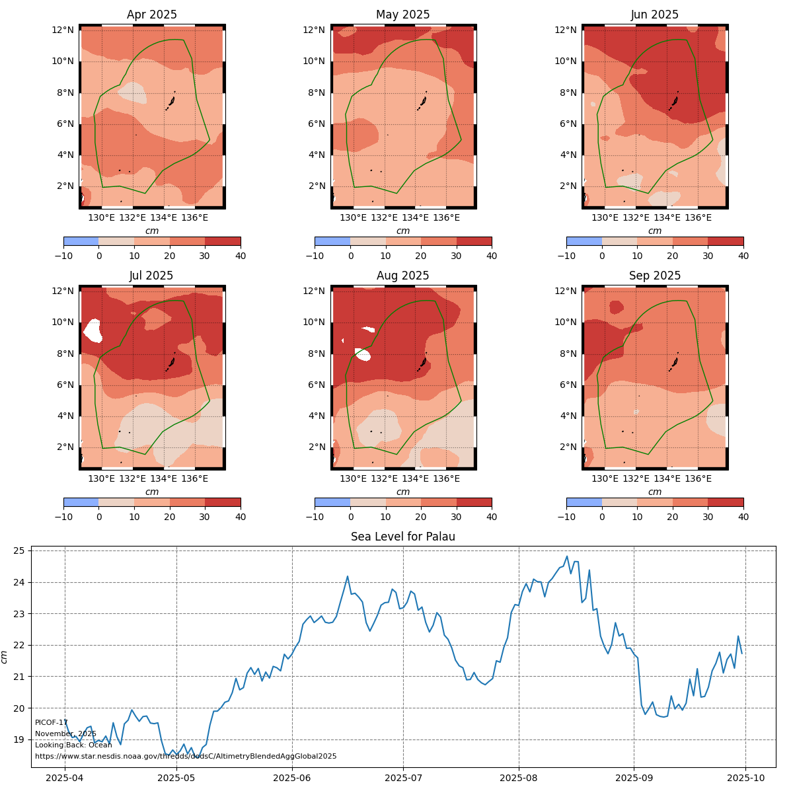

[README.md](https://github.com/user-attachments/files/23752918/README.md)
<center>

# Generating Figures for PICOF Ocean Variables: Looking Back


</center>

-----

_November 2025_ <br>
__J. Potemra__

-----

This notebook will generate figures for the Pacific Islands Climate Outlook Forum (PICOF).  More specifically, these figure comprise the session on "Looking Back," wherein data from the past six months are used to understand both what happened but also how good the forecast from last PICOF ("Looking Forward") were.

The data used come from OPeNDAP servers, so there is no need download anything execpt the EEZ shapefiles (these must be on local disk).  The notebook will access data, create monthly means for specific regions (countries), and then plot these as indivudal maps (one per month) and a time-series (average over the entire region).  For example:

<center>

</center>

The script is setup to access and plot the following:
  1. __Sea Surface Temperature anomalies__: Daily values on 5km grid from the NOAA Coral Reef Watch Program (https://coralreefwatch.noaa.gov/) <font color='red'>[__NOTE__: obtained from the PacIOOS data server] </font>
  2. __Sea Level anomalies__: daily values on a 1/4-degree grid from the NOAA Center for Satellite Applications and Research (https://www.star.nesdis.noaa.gov/star/index.php)
  3. __Precipitation__: 3-hourly values on a 1/4-degree grid from the NOAA National Centers for Environmental Prediction (NCEP) Global Forecast System (GFS) <font color='red'>[__NOTE__: this is model output; also there is no climatology, so this is just mean values and not anomalies]</font>
  4. __Coral Bleaching Alerts__: daily values on a 5km grid from the NOAA Coral Reef Watch Program (https://coralreefwatch.noaa.gov/) <font color='red'>[__NOTE__: obtained from the PacIOOS data server]</font>

## Generate plots

To make the plots, just run each cell below.  The cells include several functions to control different parts of the process.  After importing the necessary python packages, these functions are executed.  At the end should be a "widget" that allows the user to select the time-frame, variable, and country.  After making the selections, click on the button "Generate the Figure" to make the plots.  Note this will take a few minutes to run.  The figures should appear in the notebook and saved as png images on location disk in the subdirectory "images" with the variable and region in the file name (e.g., _temp_map_Palau_April_2025_LB.png_ for SST anomalies around Palau for the six months leading up to April 2025).

The widget values and control are defined after the packages are imported.  When the "Generate the Figure" is selected via button-click, the function _fig_gen_ is run.  This function uses the input to extract time-ranges, country and variable.  It then calls the appropriate _get_data_ function to extract the data.  This is done by first calling _get_shapefile_ to load the specific countries EEZ shapefile.  This file is used to get the lat/lon domain for the plot (_get_bbox_).  This function will then extract data for the specified country and make six monthly means, and it will also produce an area-mean time-series.

Next, _make_plot_ is called to generate the figure.  This routine will generate the color-shaded plots (contourf), overlay the shapefile boundary and use the _plot_zebra_frame_ function to produce the map labels.

  * add_zebra_frame(ax, lw=2, segment_length=0.5, crs=crs.PlateCarree())
  * get_map_frame_specs(ax, lw=5, segment_length=2, crs=crs.PlateCarree())
  * get_bbox(shape_gpd)
  * get_shapefile(shape_name)
  * get_temp_data( variable, country, time1, time2 )
  * make_plot( url, country, variable, time1, time2, lat2d, lon2d, lat1, lat2, lon1, lon2, 
               mon_mean, spatial_mean, shape_gpd )
  * fig_gen(c_select,v_select,s_select,t_select,y_select)

## Technical details
  * clicking on the plot button will run the function "plot_on_click"
  * plot_on_click then prints some details about the request and runs the function "fig_gen"
  * fig_gen sets the parameters for the figures and calls
     * get_xxx_data where xxx is specific for each variable (e.g., get_temp_data)
     * make_plot
  * get_xxx_data then
     * runs get_shapefile to get the shapefile
     * gets the lat/lon boundaries from the shapefile
     * gets the data from the specific OPeNDAP server
     * converts the longitude
     * "slices" the global data set to the specific region using the lat/lon boundaries in the shapefile
     * computes six monthly means over the region (this displayed in the maps)
     * computes the area-mean over the entire boundary (this displayed in the time-series)
  * make_plot then
     * sets the axis labels, color range and palette, shapefile outline color
     * loops six times, once for each map/month
        * color shading with contourf
        * draws frame using add_zebra_frame
        * draws EEZ outline from shapefile
  * NOTE: the longitudes in these shapefiles are defined as 0 to 360, while some of the data (e.g., SST from CRW) is defined from -180 to 180.  Oddly, the contourf program uses 0 to 180 for Eastern longitudes and -180 to -120 for Western (so this is non-continuous across the Dateline...)


```python
# import packages
# data I/O and processing
import xarray as xr
import pandas as pd
import numpy as np

# data plotting
import matplotlib.pyplot as plt
from matplotlib import colors
import cartopy.crs as ccrs
import cartopy.feature as cfeature
import cartopy.util as cutil
import seaborn as sns
import geopandas as gpd
import datetime
from dateutil.relativedelta import relativedelta
from shapely.geometry import LineString, Polygon
from shapely.ops import split

# need this for widgets
import ipywidgets as widgets 
from IPython.display import display, clear_output
get_ipython().run_line_magic('matplotlib','inline')
from ipywidgets import HBox, VBox
```


```python
# define the widget contents/options

# these all define what appears in a widget pulldown menu and
# and the value given to it.  These are accessable via .label
# and .value, respectively.  For example, the item pair 
# ('American Samoa', 'American_Samoa') will show "American Samoa" 
# in the menu, and "American_Samoa" as the assigned value if 
# selected. 

c_select = widgets.Dropdown(
    options = [('Pacific Basin','Pacific_Island_EEZ'),
               ('American Samoa', 'American_Samoa'),
               ('Austral Islands', 'Austral_Islands'),
               ('Federated States of Micronesia', 'Federated_States_of_Micronesia'),
               ('Fiji', 'Fiji'),
               ('Guam', 'Guam'),
               ('Kiribati, Gilbert Islands', 'Kiribati_Gilbert_Islands'),
               ('Kiribati, Line Islands', 'Kiribati_Line_Islands'),
               ('Kiribati, Phoenix Islands', 'Kiribati_Phoenix_Islands'),
               ('Marquesas', 'Marquesas'),
               ('Marshall Islands', 'Marshall_Islands'),
               ('Nauru', 'Nauru'),
               ('New Calidonia', 'New_Caledonia'),
               ('Niue', 'Niue'),
               ('Northern Cook Islands', 'Northern_Cook_Islands'),
               ('Northern Marianas', 'Northern_Marianas'),
               ('Palau', 'Palau'),
               ('Papua New Guinea', 'Papua_New_Guinea'),
               ('Pitcairn', 'Pitcairn_Islands'),
               ('Samoa', 'Samoa'),
               ('Society Islands', 'Society_Islands'),
               ('Solomon Islands', 'Solomon_Islands'),
               ('Southern Cook Islands', 'Southern_Cook_Islands'),
               ('Tokelau', 'Tokelau'),
               ('Tonga', 'Tonga'),
               ('Tuamotu', 'Tuamotu__Gambier_Islands'),
               ('Tuvalu', 'Tuvalu'),
               ('Vanuatu (North)', 'Vanuatu_North'),
               ('Vanuatu (South)', 'Vanuatu_South'),
               ('Wallis and Futuna', 'Wallis_&_Futuna')
              ],
    description = 'Country of interest:',
)

y_select = widgets.Dropdown(
    options = [(2025)],
    description = 'Year:',
)

s_select = widgets.Dropdown(
    options = [('Looking back', 'LB')],
    description = 'Session:',
)

t_select = widgets.Dropdown(
    options = [('April', 'spring'), 
              ('November', 'fall'),
             ],
    description = 'Month:',
)

p_select = widgets.Dropdown(
    options = [('PICOF-17')],
    description = 'PICOF:',
)

v_select = widgets.Dropdown(
    options = [('Sea Surface Temperature', 'CRW_SSTANOMALY'), 
               ('Sea Level Anomalies', 'sla'),
               ('Precipitation', 'pratesfc'),
               ('Bleaching Alert', 'CRW_BAA'),
               ('NINO-3.4', 'nino'),
               ('Degree Heating Weeks', 'DHW'),
               ('Marine Heat Waves', 'MHW'),
               ('other','other'),
              ],
    description = 'Variable:',
)

# capture the output from button click
button_output = widgets.Output()

# here we define the "action" widget, which is a clickable
# button in this case (widgets.Button).  The "description"
# item is what shows up on the botton itself.

button = widgets.Button(
   description = 'Generate the Figure'
)

#example check box; not used
#modelx = widgets.Checkbox(
#    value=False,
#    description='Click for model',
#    disabled=False
#)
```


```python
# functiont plot_on_click to define what to do on button click
def plot_on_click(b):
    with button_output:
        clear_output()
        print('The following plot has been requested')
        print('     ',v_select.label,'for',c_select.label)
        print('     Oceans:', s_select.label, 'for', t_select.label, y_select.label, 'PICOF')
        print("start plot")
        fig_gen(c_select,v_select,s_select,t_select,y_select)
        print("end plot")
```


```python
# function get_map_frame_specs to define tick marks and frame specs for map plots
def get_map_frame_specs( ax, lw = 2, segment_length = 0.5, crs = ccrs.PlateCarree() ):
    # Get the current extent of the map
    left, right, bot, top = ax.get_extent(crs=crs)

    # Calculate the nearest 0 or 0.5 degree mark within the current extent
    left_start = left - left % segment_length
    bot_start = bot - bot % segment_length

    # Adjust the start if it does not align with the desired segment start
    if left % segment_length >= segment_length / 2:
        left_start += segment_length
    if bot % segment_length >= segment_length / 2:
        bot_start += segment_length

    # Extend the frame slightly beyond the map extent to ensure full coverage
    right_end = right + (segment_length - right % segment_length)
    top_end = top + (segment_length - top % segment_length)

    # Calculate the number of segments needed for each side
    num_segments_x = int(np.ceil((right_end - left_start) / segment_length))
    num_segments_y = int(np.ceil((top_end - bot_start) / segment_length))
    
    # Draw horizontal stripes at the top and bottom
    for i in range(num_segments_x):
        #color = 'black' if (left_start + i * segment_length) % (2 * segment_length) == 0 else 'white'
        color = 'black' if (i * segment_length) % (2 * segment_length) == 0 else 'white'
        start_x = left_start + i * segment_length
        end_x = start_x + segment_length
        ax.hlines([bot, top], start_x, end_x, colors=color, linewidth = lw, transform = crs)

    # Draw vertical stripes on the left and right
    for j in range(num_segments_y):
        #color = 'black' if (bot_start + j * segment_length) % (2 * segment_length) == 0 else 'white'
        color = 'black' if (j * segment_length) % (2 * segment_length) == 0 else 'white'
        start_y = bot_start + j * segment_length
        end_y = start_y + segment_length
        ax.vlines([left, right], start_y, end_y, colors=color, linewidth = lw, transform = crs )
```


```python
# function plot_zebra_frame to draw a frame around the map
def plot_zebra_frame( ax, lw = 5, segment_length=  2, crs = ccrs.PlateCarree() ):
    """
    Plot a zebra frame on the given axes.

    Parameters:
    - ax: The axes object on which to plot the zebra frame.
    - lw: The line width of the zebra frame. Default is 5.
    - segment_length: The length of each segment in the zebra frame. Default is 2.
    - crs: The coordinate reference system of the axes. Default is ccrs.PlateCarree().
    """
    # Call the function to add the zebra frame
    get_map_frame_specs( ax = ax, lw = lw, segment_length = segment_length, crs = crs ) 
    
    # add map grid

    # the locations of the x-tick marks are not properly defined, so
    # have to adjust here; likely a projection issue (?)
    
    new_xtick_loc = ax.get_xticks()
    for I in range(len(new_xtick_loc)):
        new_xtick_loc[I] = new_xtick_loc[I] + 180 if new_xtick_loc[I] < 0 else new_xtick_loc[I] - 180
    #gl = ax.gridlines( draw_labels = True, linestyle = ':', color = 'black',
    #                  alpha = 0.5, xlocs = ax.get_xticks(), ylocs = ax.get_yticks() )
    gl = ax.gridlines( draw_labels = True, linestyle = ':', color = 'black',
                      alpha = 0.5, xlocs = new_xtick_loc, ylocs = ax.get_yticks() )
    
    #remove labels from top and right axes
    gl.top_labels = False
    gl.right_labels = False
```


```python
# function get_bbox get lat/lon bounding box
def get_bbox(shape_gpd):
    # manually set range for basin-wide plot
    # (NOTE: I just check the length of the shapefile;
    #  there is definitely a better way to do this as
    #  this is specific to my EEZ shapefile size
    if len(shape_gpd) == 36:
        min_lon, min_lat, max_lon, max_lat = 125, -35, 245, 35
    else:
        min_lon, min_lat, max_lon, max_lat = shape_gpd.total_bounds
    delta = ( max_lat - min_lat ) / 10.0
    lat2, lat1 = max_lat + delta, min_lat - delta
    lon2, lon1 = max_lon + delta, min_lon - delta

    return lat1, lat2, lon1, lon2
```


```python
# function to get the shapefile for requested country
def get_shapefile(shape_name):

    # if Pacific-wide plot, just get shape
    if shape_name == 'Pacific_Island_EEZ':
        shape_gpd = gpd.read_file('./shapefiles/' + shape_name + '.shp' )
    else:
        # read the EEZ as a shape file (match name to country)
        shape_gpd = gpd.read_file('./shapefiles/shapes_' + shape_name + '_converted.shp')

        '''
        # adjust shapefile if region extends over dateline

        # Create a line representing the dateline
        dateline = LineString([(180, -90), (180, 90)])
        # Function to split and adjust geometries
       
        def handle_dateline_crossing(geom):
            if geom.crosses(dateline):
                split_geoms = split(geom, dateline)
                new_geoms = []
                for part in split_geoms.geoms:
                    # Adjust longitudes for parts east of the dateline
                    if part.bounds[0] > 0 and part.bounds[2] > 180:
                        adjusted_coords = [(x - 360, y) for x, y in part.exterior.coords]
                        new_geoms.append(Polygon(adjusted_coords))
                    else:
                        new_geoms.append(part)
                return new_geoms
            return [geom]
        
        # Apply the function to the GeoDataFrame if it extends across dateline
        if ( shape_gpd['max_x'][0] == 180.0 ) and ( shape_gpd['max_x'][0] == 180.0 ):
            shape_gpd['geometry2'] = shape_gpd['geometry'].apply(handle_dateline_crossing)
            shape_gpd.rename(columns={'geometry': 'geometry3', 'geometry2': 'geometry'})
            shape_gpd = shape_gpd.explode(index_parts=True) # Explode multi-geometries into single-geometries
        '''
    return shape_gpd
```


```python
# function get_temp_data to get temperature data from NOAA CRW
def get_temp_data( variable, country, time1, time2 ):

    # define data service end point
    url = 'https://pae-paha.pacioos.hawaii.edu/thredds/dodsC/dhw_5km'
    
    # get shapefile
    shape_gpd = get_shapefile(country)

    # get bounding box
    lat1, lat2, lon1, lon2 = get_bbox(shape_gpd)
    
    # get variable of interest
    ds = xr.open_dataset(url)

    # need this since the CRW data are -180 to 180 longitude, need
    # 0 to 360 to match shapefiles
    ds.coords['longitude'] = (ds.coords['longitude'] + 360) % 360
    ds = ds.sortby(ds.longitude)

    plot_var = ds[variable].sel(time=slice(time1,time2),
                     latitude=slice(lat2,lat1),
                     longitude=slice(lon1,lon2))

    lat2d, lon2d = np.meshgrid(plot_var['latitude'],plot_var['longitude'])

    # compute the monthly mean
    #   use this for quick test
    #mon_mean = plot_var[0:6,:,:].transpose('time','longitude','latitude')
    #   use this for real
    mon_mean = plot_var.resample(time="ME").mean().transpose('time','longitude','latitude')

    # compute the spatial mean
    if country == 'Pacific_Island_EEZ':
        spatial_mean = mon_mean
    else:
        #   use this for quick test
        #spatial_mean = plot_var[:,0,0]
        #   use this for real
        spatial_mean = plot_var.mean(dim=['latitude', 'longitude'])

    return url, lat2d, lon2d, lat1, lat2, lon1, lon2, mon_mean, spatial_mean, shape_gpd
```


```python
# function get_baa_data to get bleaching alert data from NOAA CRW
def get_baa_data( variable, country, time1, time2 ):

    # define data service end point
    url = 'https://pae-paha.pacioos.hawaii.edu/thredds/dodsC/dhw_5km'
    
    # get shapefile
    shape_gpd = get_shapefile(country)

    # get bounding box
    lat1, lat2, lon1, lon2 = get_bbox(shape_gpd)
    
    # get variable of interest
    ds = xr.open_dataset(url)

    # need this since the CRW data are -180 to 180 longitude, need
    # 0 to 360 to match shapefiles
    ds.coords['longitude'] = (ds.coords['longitude'] + 360) % 360
    ds = ds.sortby(ds.longitude)
    #ds[variable].loc[ds[variable] < 3] = 0
    #ds[variable].loc[ds[variable] > 2] = 1

    plot_var = ds[variable].sel(time=slice(time1,time2),
                     latitude=slice(lat2,lat1),
                     longitude=slice(lon1,lon2))

    lat2d, lon2d = np.meshgrid(plot_var['latitude'],plot_var['longitude'])

    # compute the monthly mean
    #   use this for quick test
    #mon_mean = plot_var[0:6,:,:].transpose('time','longitude','latitude')
    #   use this for real

    # here we set a bleaching alert level 3 or higher to simply 1
    # and less than 3 to zero; this is to get simply a day when BAA=3 or 4
    plot_var = plot_var.where( plot_var > 2.0, other = 0.0 )
    plot_var = plot_var.where( plot_var < 3.0, other = 1.0 )
    mon_mean = plot_var.resample(time="ME").sum().transpose('time','longitude','latitude')

    # compute the spatial mean
    if country == 'Pacific_Island_EEZ':
        spatial_mean = mon_mean
    else:
        #   use this for quick test
        #spatial_mean = plot_var[:,0,0]
        #   use this for real
        spatial_mean = plot_var.mean(dim=['latitude', 'longitude'])

    return url, lat2d, lon2d, lat1, lat2, lon1, lon2, mon_mean, spatial_mean, shape_gpd
```


```python
# function get_rain_data to get precipitation data from PacIOOS
def get_rain_data( variable, country, time1, time2 ):

    # define data service end point
    url = 'https://pae-paha.pacioos.hawaii.edu/thredds/dodsC/ncep_pac/NCEP_Pacific_Atmospheric_Model_best.ncd'
    
    # get shapefile
    shape_gpd = get_shapefile(country)

    # get bounding box
    lat1, lat2, lon1, lon2 = get_bbox(shape_gpd)
    
    # get variable of interest
    ds = xr.open_dataset(url)
    
    plot_var = ds[variable].sel(time=slice(time1,time2),
                     latitude=slice(lat1,lat2),
                     longitude=slice(lon1,lon2))
    
    # convert to mm/hr
    plot_var = plot_var * 3600.0

    lat2d, lon2d = np.meshgrid(plot_var['latitude'],plot_var['longitude'])

    # compute the monthly mean
    #   use this for quick test
    #mon_mean = plot_var[0:6,:,:].transpose('time','longitude','latitude')
    #   use this for real
    mon_mean = plot_var.resample(time="ME").mean().transpose('time','longitude','latitude')

    # compute the spatial mean
    #   use this for quick test
    #spatial_mean = plot_var[:,0,0]
    #   use this for real
    spatial_mean = plot_var.mean(dim=['latitude', 'longitude'])

    return url, lat2d, lon2d, lat1, lat2, lon1, lon2, mon_mean, spatial_mean, shape_gpd
```


```python
# function get_clev_data to get sea level data from NOAA CoastWatch
def get_clev_data( variable, country, time1, time2 ):

    # define data service end point
    url = 'https://www.star.nesdis.noaa.gov/thredds/dodsC/AltimetryBlendedAggGlobal2025'
    
    # get shapefile
    shape_gpd = get_shapefile(country)

    # get bounding box
    lat1, lat2, lon1, lon2 = get_bbox(shape_gpd)
    
    # get variable of interest
    ds = xr.open_dataset(url)

    # need this since the CW data are -180 to 180 longitude, need
    # 0 to 360 to match shapefiles
    ds.coords['longitude'] = (ds.coords['longitude'] + 360) % 360
    ds = ds.sortby(ds.longitude)

    plot_var = ds[variable].sel(time=slice(time1,time2),
                     latitude=slice(lat1,lat2),
                     longitude=slice(lon1,lon2))

    # convert from meters to cm
    plot_var = plot_var * 100.0

    lat2d, lon2d = np.meshgrid(plot_var['latitude'],plot_var['longitude'])

    # compute the monthly mean
    #   use this for quick test
    #mon_mean = plot_var[0:6,:,:].transpose('time','longitude','latitude')
    #   use this for real
    mon_mean = plot_var.resample(time="ME").mean().transpose('time','longitude','latitude')

    # compute the spatial mean
    #   use this for quick test
    #spatial_mean = plot_var[:,0,0]
    #   use this for real
    spatial_mean = plot_var.mean(dim=['latitude', 'longitude'])

    return url, lat2d, lon2d, lat1, lat2, lon1, lon2, mon_mean, spatial_mean, shape_gpd
```


```python
# function get_sample_data to get coarse-res data from WOA as quick test of code
def get_sample_data( variable, country, time1, time2 ):
    
    # define data service end point
    url = 'http://apdrc.soest.hawaii.edu:80/dods/public_data/WOA/WOA13/5_deg/monthly/temp'
    
    # get shapefile
    shape_gpd = get_shapefile(country)

    # get bounding box
    lat1, lat2, lon1, lon2 = get_bbox(shape_gpd)
          
    # get variable of interest
    time_coder = xr.coders.CFDatetimeCoder(use_cftime=True)
    ds = xr.open_dataset(url,decode_times=time_coder)

    # need this since the CW data are -180 to 180 longitude, need
    # 0 to 360 to match shapefiles
    ds.coords['lon'] = (ds.coords['lon'] + 360) % 360
    ds = ds.sortby(ds.lon)

    plot_var = ds['tmn'].sel(lat=slice(lat1,lat2),lon=slice(lon1,lon2),lev=0)

    lat2d, lon2d = np.meshgrid(plot_var['lat'],plot_var['lon'])
    
    # compute the monthly mean
    #   use this for quick test
    mon_mean = plot_var[0:6,:,:].transpose('time','lon','lat')
    #   use this for real
    #mon_mean = plot_var.resample(time="ME").mean().transpose('time','longitude','latitude')

    # compute the spatial mean
    #   use this for quick test
    spatial_mean = plot_var[:,0,0]
    #   use this for real
    #spatial_mean = plot_var.mean(dim=['latitude', 'longitude'])

    return url, lat2d, lon2d, lat1, lat2, lon1, lon2, mon_mean, spatial_mean, shape_gpd
```


```python
# function make_plot to make figure with maps on the top and a time-series at the bottom

# The setup is to have maps on the top of the figure in two rows, three columns (six monthly
# means, and then one line plot on the bottom that extends across all three columns.

def make_plot( url, country, variable, time1, time2, lat2d, lon2d, lat1, lat2, lon1, lon2, 
               mon_mean, spatial_mean, shape_gpd ):

    # define projection; here we include one with the central longitude defined and
    # the other without. 
    # NOTE: the functions that require "projection" use ccrs2 (add_subplot and zebra frame,
    #   while plotting function that use "transform" use ccrs (contourf and shape.boundary.plot)
    ccrs1 = ccrs.PlateCarree()
    ccrs2 = ccrs.PlateCarree(central_longitude=180.0)

    if variable == 'CRW_SSTANOMALY':
        # set titles
        y_label = '$^{\circ}C$'
        plot_title = 'SST Anomalies for ' + country
        # color range for shading (in degrees C)
        color_min, color_max = -0.50, 2.5
        cbarticks=np.arange( color_min, color_max + 0.5, 0.5 )
        # colormap
        cmap = sns.color_palette( "coolwarm", as_cmap = True )
        # EEZ line color
        eez_color = 'green'
        
    elif variable == 'pratesfc':
        # set titles
        y_label = '$mm/hr$'
        plot_title = 'Precipitation for ' + country
        # color range for shading (in mm/sec); this for anomalies
        #color_min, color_max = -0.75, 0.75
        #cbarticks = np.arange( color_min, color_max + 0.25, 0.25 )
        color_min, color_max = 0, 1.0
        cbarticks = np.arange( color_min, color_max + 0.2, 0.2 )
        
        cmap = sns.color_palette( "BrBG", as_cmap = True )
        # EEZ line color
        eez_color = 'yellow'

    elif variable == 'sla':
        # set titles
        y_label = '$cm$'
        plot_title = 'Sea Level for ' + country
        # color range for shading (in mm/sec)
        color_min, color_max = -10.0, 40.0
        cbarticks = np.arange( color_min, color_max + 10.0, 10.0 )
        # colormap
        cmap = sns.color_palette( "coolwarm", as_cmap = True )
        # EEZ line color
        eez_color = 'green'

    elif variable == 'CRW_BAA':
        # set titles
        y_label = 'days'
        plot_title = 'Number of days with bleaching alert 3 or 4'
        # color range for shading (in mm/sec)
        color_min, color_max = 2, 20
        cbarticks = np.arange( color_min, color_max + 4, 4 )
        # colormap
        cmap = sns.color_palette( "YlOrRd", as_cmap = True )
        # EEZ line color
        eez_color = 'green'

    elif variable == 'other':
        # set titles
        y_label = 'deg C'
        plot_title = 'SST'
        # color range for shading (in mm/sec)
        color_min, color_max = 5, 30
        cbarticks = np.arange( color_min, color_max + 5, 5 )
        # colormap
        cmap = sns.color_palette( "coolwarm", as_cmap = True )
        # EEZ line color
        eez_color = 'green'

    # "normalize" the color map; this means for example center the colors around zero
    if variable == 'other' or variable =='pratesfc':
        norm = colors.Normalize( vmin = color_min, vmax = color_max )
    elif variable == 'CRW_BAA':
        norm = colors.Normalize( vmin = color_min, vmax = color_max )
    else:
        norm = colors.TwoSlopeNorm( vmin = color_min, vmax = color_max, vcenter = 0.0 )

    # for basin-wide plot, just need one without timeseries; for all others
    # need six-panel maps and one panel timeseries

    if country == 'Pacific Basin':
        
        for i in range(1,7):

            fig = plt.figure ( figsize = (18,10) )

            if variable != 'other':
                datetime_object = datetime.datetime.strptime(time1, '%m-%d-%Y')
                datetime_object = datetime_object + relativedelta( months =  ( i - 1 ) )
                date_title = datetime_object.strftime('%b %Y')
            else:
                date_title = str(i)
        
            ax = fig.add_subplot( projection = ccrs2 )
            ax.set_extent( [lon1,lon2,lat1,lat2], crs = ccrs1 )
            
            img = ax.contourf(lon2d, lat2d, mon_mean[i-1,:,:].values, cbarticks,
                              transform = ccrs1, norm = norm,
                              cmap = cmap, extend = 'neither' )

       
            cbar = plt.colorbar( img, ax = ax, ticks = cbarticks, orientation = 'horizontal',
                                 anchor = ( 0.5, 0.01), fraction=0.04, pad=0.125 )
            cbar.ax.text( (color_max - color_min)/2.0 + color_min, 1.1, y_label, 
                            va='bottom', ha='center', fontsize = 10 ) 
            ax.coastlines()
            ax.add_feature(cfeature.LAND, color='lightgrey')      
            ax.set_title(plot_title + ': ' + date_title)
        
            # Call the function to add the zebra frame
            plot_zebra_frame( ax, lw = 6, segment_length = 5.0, crs = ccrs2 )

            # add the EEZ, remove boarder
            axs = shape_gpd.boundary.plot( ax = ax, color = eez_color, transform = ccrs1, linewidth = 1 )

            # save plot
            plt.savefig('./images/' + v_select.value + '_map_' + c_select.value + '_' + \
                        t_select.label + '_' + str(y_select.value) + '_' + s_select.value + str(i) + '.png')

            # show plot
            plt.show()
        
    else:
        # plot the maps
        #fig = plt.figure( figsize=(12,12), layout = 'constrained' )
        fig = plt.figure( figsize = (12,12) )

        # Add cyclic point; this needed for contries that straddle the dateline
        cdata, clon2d, clat2d = cutil.add_cyclic( mon_mean, lon2d, lat2d )
        
        for i in range(1,7):

            if variable != 'other':
                datetime_object = datetime.datetime.strptime(time1, '%m-%d-%Y')
                datetime_object = datetime_object + relativedelta( months = ( i - 1 ) )
                date_title = datetime_object.strftime('%b %Y')
            else:
                date_title = str(i)

            ax = fig.add_subplot( 3, 3, i, projection = ccrs2 )
            
            ax.set_extent( [lon1,lon2,lat1,lat2], crs = ccrs1 )
            
            img = ax.contourf( clon2d, clat2d, cdata[i-1,:,:], cbarticks,
                               transform = ccrs1, norm = norm,
                               cmap = cmap, extend = 'neither' )
            
            cbar = plt.colorbar( img, ax = ax, ticks = cbarticks, orientation = 'horizontal',
                                 anchor = ( 0.5, 0.01 ), fraction = 0.04, pad = 0.125 )
            cbar.ax.text( (color_max - color_min)/2.0 + color_min, 1.1, y_label, 
                           va = 'bottom', ha = 'center', fontsize = 10 ) 
            ax.coastlines()
            ax.add_feature( cfeature.LAND, color = 'lightgrey' )      
            ax.set_title(date_title)
            
            # Call the function to add the zebra frame
            plot_zebra_frame( ax, lw = 6, segment_length = 2.0, crs = ccrs2 )
              
            # add the EEZ, remove boarder
            axs = shape_gpd.boundary.plot( ax = ax, color = eez_color, transform = ccrs1, linewidth = 1 )
    
        # plot timeseries
        ax = fig.add_subplot(3,1,3)
        #plt.subplots_adjust(wspace=2.0,hspace=4.0)
        plt.tight_layout()
        if variable == 'other':
            ax.plot(spatial_mean.values)
        else:
            ax.plot(spatial_mean['time'],spatial_mean.values)
        ax.set_ylabel(y_label)
        ax.grid(linestyle = 'dashed', color = 'grey')
        ax.set_title(plot_title)

        # add some metadata to the time-series plot
        ax.text( 0.005, 0.20, p_select.value, va = 'center', ha = 'left', fontsize = 8, transform=ax.transAxes )
        ax.text( 0.005, 0.15, t_select.label + ', ' + str(y_select.value), va = 'center', 
                 ha = 'left', fontsize = 8, transform=ax.transAxes )
        ax.text( 0.005, 0.10, s_select.label + ': Ocean', va = 'center', 
                 ha = 'left', fontsize = 8, transform=ax.transAxes )
        ax.text( 0.005, 0.05, url, va = 'center', 
                 ha = 'left', fontsize = 8, transform=ax.transAxes )

        # save plot
        plt.savefig('./images/' + v_select.value + '_map_' + c_select.value + '_' + \
                    t_select.label + '_' + str(y_select.value) + '_' + s_select.value + '.png')

        # show plot
        plt.show()
```


```python
# function fig_gen, main routine to generate figure (called on button click)
def fig_gen(c_select,v_select,s_select,t_select,y_select):
    
    variable = v_select.value
    country1 = c_select.label
    country2 = c_select.value
        
    if t_select.value == 'fall':
        if s_select.value == 'LB':
            time1, time2 = '04-01-' + str(y_select.value), '09-30-' + str(y_select.value)
        else:
            time1, time2 = '10-01-' + str(y_select.value), '03-31-' + str(y_select.value+1)
    elif t_select.value == 'spring':
        if s_select.value == 'LB':
            time1, time2 = '10-01-' + str(y_select.value-1), '03-31-' + str(y_select.value)
        else:
            time1, time2 = '04-01-' + str(y_select.value), '09-30-' + str(y_select.value)

    if variable == 'CRW_SSTANOMALY':
        url, lat2d, lon2d, lat1, lat2, lon1, lon2, map_data, ts_data, shape = \
        get_temp_data(variable,country2,time1,time2)
    elif variable == 'pratesfc':
        url, lat2d, lon2d, lat1, lat2, lon1, lon2, map_data, ts_data, shape = \
        get_rain_data(variable,country2,time1,time2)
    elif variable == 'sla':
        url, lat2d, lon2d, lat1, lat2, lon1, lon2, map_data, ts_data, shape = \
        get_clev_data(variable,country2,time1,time2)
    elif variable == 'CRW_BAA':
        url, lat2d, lon2d, lat1, lat2, lon1, lon2, map_data, ts_data, shape = \
        get_baa_data(variable,country2,time1,time2)
    elif variable == 'other':
        url, lat2d, lon2d, lat1, lat2, lon1, lon2, map_data, ts_data, shape = \
        get_sample_data(variable,country2,time1,time2)
        
    make_plot(url,country1,variable,time1,time2,lat2d,lon2d,lat1,lat2,lon1,lon2,map_data,ts_data,shape)
```


```python
# produce menu widget to make plot
button.on_click(plot_on_click)
display(button,button_output)
line1 = HBox(children=[c_select,p_select])
line2 = HBox(children=[s_select,t_select])
line3 = HBox(children=[v_select,y_select])
#VBox(children=[line1,line2,line3,button])
VBox(children=[line1,line2,line3])

#button.on_click(plot_on_click)
#display(button,button_output)
```


    Button(description='Generate the Figure', style=ButtonStyle())


    Output()


    VBox(children=(HBox(children=(Dropdown(description='Country of interest:', options=(('Pacific Basin', 'Pacific…


